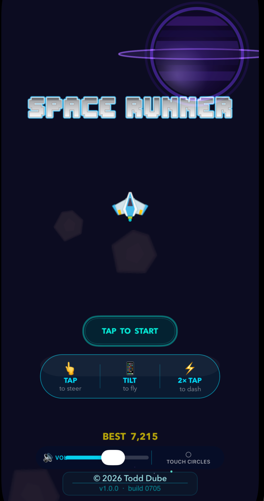
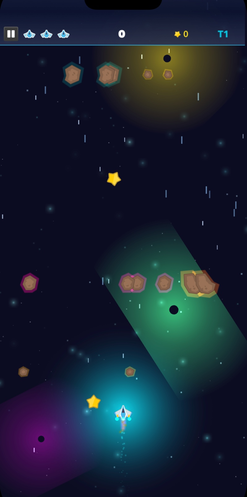

# SpaceRunner

A fast-paced iOS space endless runner built with SpriteKit, targeting iOS 26+.

[](https://swift.org)
[](https://developer.apple.com/ios/)
[](https://developer.apple.com/xcode/)

---

## Screenshots

| Main Menu | Gameplay |
|:---:|:---:|
| [](screenshots/menu.png) | [](screenshots/gameplay.jpeg) |

## Overview

SpaceRunner is an arcade endless runner where you pilot a spaceship through an ever-thickening field of meteors, collect stars, and chase high scores. The game features a cinematic ship-assembly intro, a top-of-screen glass HUD, a dash mechanic, power-ups, and a full enhanced-graphics pipeline built on top of SpriteKit.

---

## Features

| Category | Details |
|---|---|
| **Gameplay** | Dodge meteors, collect stars, streak multipliers, dash mechanic, power-ups (shield, magnet, slow-mo) |
| **Progression** | 4 score-based difficulty tiers — speed, spawn rate, and obstacle mix all scale |
| **Controls** | Touch to steer, double-tap to dash, gyroscope tilt navigation |
| **Visuals** | Ship assembly intro, multi-layer parallax, nebula system, dynamic lighting, additive-blend particles, cinematic camera shake |
| **HUD** | Compact top-of-screen glass bar — lives, score, spinning star count, tier badge, power-up indicator, pause |
| **Audio** | AVAudioEngine spatial audio, layered engine sounds, background music with background/foreground lifecycle management |
| **Accessibility** | VoiceOver, haptic feedback, Dynamic Type support |
| **Modern iOS** | `@Observable`, `@MainActor`, `async/await`, Swift 6 concurrency |

---

## Requirements

- **iOS 26.0+** (uses `@Observable`, `@MainActor`)
- **Xcode 16+**
- **Swift 6**
- Portrait orientation only; supports iPhone and iPad

---

## Getting Started

```bash
git clone https://github.com/todddube/spacerunner.git
cd spacerunner
open SpaceRunner.xcodeproj
```

Select a simulator or connected device and press **⌘R**.

> Building for a physical device requires a valid provisioning profile in your Apple Developer account.

---

## Controls

| Gesture | Action |
|---|---|
| Tap / drag | Steer the ship toward your finger |
| Double-tap | Dash in that direction (6 s recharge) |
| Tilt | Gyroscope navigation (requires motion permission) |
| Pause button | Top-left of the glass HUD — toggles pause/resume |
| Tap anywhere (paused) | Resume game |

---

## Versioning

Version is managed via Xcode build settings:

| Setting | Key | Current |
|---|---|---|
| Marketing version | `MARKETING_VERSION` | 1.0.0 |
| Build number | `CURRENT_PROJECT_VERSION` | 0705 |

To bump the version, open **Xcode → Target → General → Identity** and update the fields there. `Info.plist` resolves the values at build time via `$(MARKETING_VERSION)` and `$(CURRENT_PROJECT_VERSION)`. No script needed.

---

## Architecture

### Scenes

| File | Role |
|---|---|
| `EnhancedMenuScene.swift` | Main menu — ship assembly animation, sparkle copyright, glass play button |
| `GameScene.swift` | Core gameplay — 4-phase state machine (tutorial → running → paused → gameOver) |
| `GameOverScene.swift` | End-game score summary and retry |

### Core Game Components

| File | Role |
|---|---|
| `Player.swift` | Ship movement (lerp + dash velocity), lives, scoring, streak |
| `Player+EnhancedEffects.swift` | Multi-layer engine trails, dash indicator dots |
| `MeteorController.swift` | Obstacle spawning and tier-based difficulty scaling |
| `StarController.swift` | Star and power-up spawning |
| `PowerUpController.swift` | Shield / magnet / slow-mo power-up lifecycle |

### Enhanced Graphics

| File | Role |
|---|---|
| `ParallaxBackground.swift` | Multi-layer depth-scrolling starfield |
| `NebulaSystem.swift` | Animated nebula clouds with additive blending |
| `DynamicLighting.swift` | Ambient and event-driven SKLightNode system |
| `EnhancedParticleManager.swift` | Explosions, debris, and collection bursts |
| `CameraEffects.swift` | Screen shake, zoom pulse, slow motion |
| `ShipAssemblyAnimation.swift` | Four-quadrant crop-node ship assembly on menu |
| `AnimationController.swift` | Centralised spring and float animation helpers |

### HUD & UI

| File | Role |
|---|---|
| `StatusBar.swift` | Top glass HUD — lives, score, star, tier, power-up dot |
| `StatusBar+GlassEffect.swift` | Show/hide slide animations and reactive pulses |
| `ModernStartButton.swift` | Liquid-glass play button with shimmer |
| `PauseButton.swift` | Pause ↔ resume texture toggle |
| `GameOverScene.swift` | End-game summary and retry — built from `SKLabelNode`s |

### Resources & Systems

| File | Role |
|---|---|
| `GameAudio.swift` | AVAudioEngine music + pooled sound effects, app lifecycle pausing |
| `GameTextures.swift` | Centralised texture cache |
| `GameFonts.swift` | Label creation with `editundo.ttf` and system-font fallback |
| `GameSettings.swift` | `@Observable` UserDefaults singleton — best score, touch-circle toggle |
| `Constants.swift` | Screen size, z-layers, physics categories, sprite names |
| `Colors.swift` | Shared colour palette (cyan, magenta, yellow, danger red) |

---

## Project Structure

Source files live flat in `SpaceRunner/`, grouped here by role for readability:

```
SpaceRunner/
├── Scenes            GameScene, EnhancedMenuScene, GameOverScene, GameViewController, AppDelegate
├── Background        ParallaxBackground, NebulaSystem, Background
├── Buttons / UI      PauseButton, ModernStartButton, StatusBar (+GlassEffect)
├── Effects           CameraEffects, AnimationController, DynamicLighting,
│                     EnhancedParticleManager, ShipBreakEffect, ShipAssemblyAnimation
├── Title Nodes       GameTitle, GameTitleShip
├── Obstacles         Meteor, MeteorController, LaserBeam
├── Player            Player (+EnhancedEffects), TouchCircle, MotionController
├── Collectibles      Star, StarController, PowerUp, PowerUpController
├── Resources         GameTextures, GameParticles, GameFonts, GameSettings,
│                     GameShaders, GameAudio (+SpatialEffects)
├── Core              Constants, Colors, Math
├── Accessibility/    AccessibilityManager
├── GameResources/
│   ├── Fonts/        editundo.ttf
│   ├── Music/        GameMusic.mp3
│   ├── Sounds/       ButtonTap, Explosion, Pickup, ShieldDown, ShieldUp (.caf)
│   └── Library/      SKTUtils — third-party SpriteKit helpers
└── Assets.xcassets  Sprites, icons, particle atlases
```

---

## Documentation

- **[ENHANCED_GRAPHICS_README.md](SpaceRunner/ENHANCED_GRAPHICS_README.md)** — deep dive into the visual pipeline: parallax system, dynamic lighting, particle effects, camera system, and animation controller.

---

## Credits

© 2026 Todd Dube. All rights reserved.
